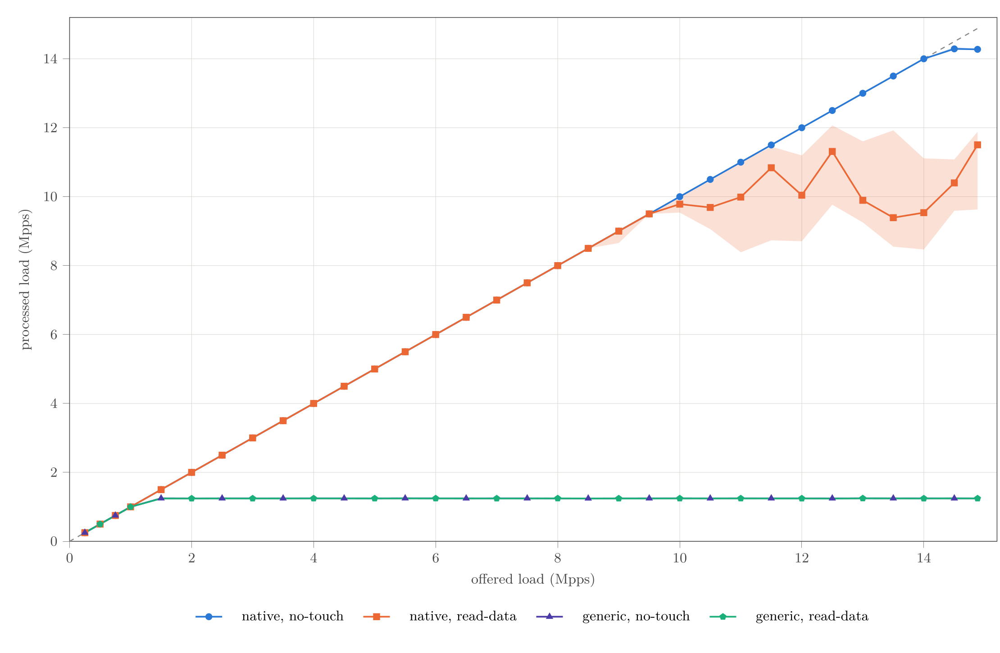
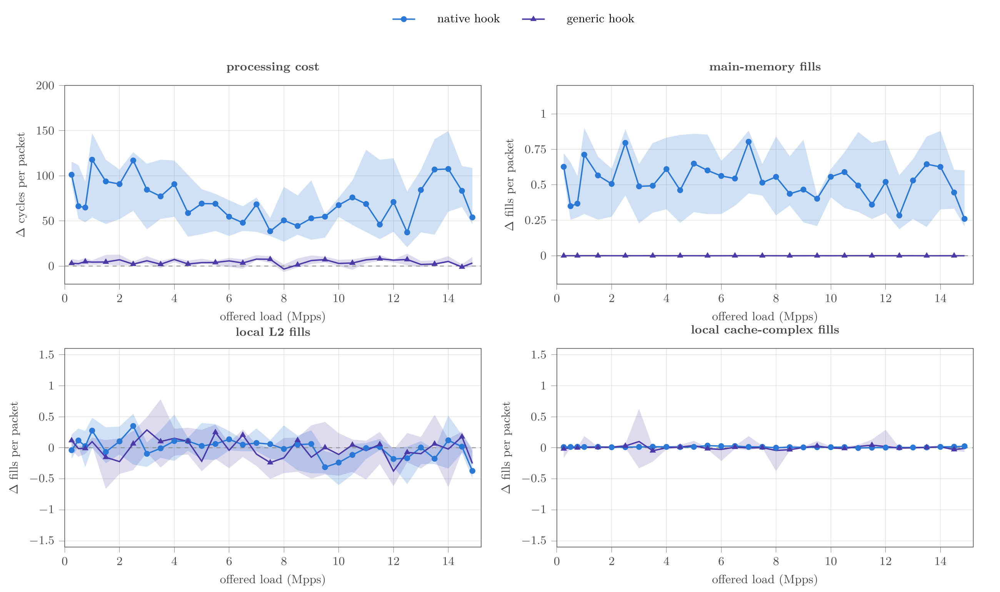
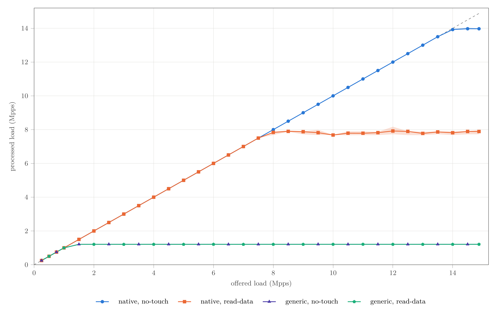
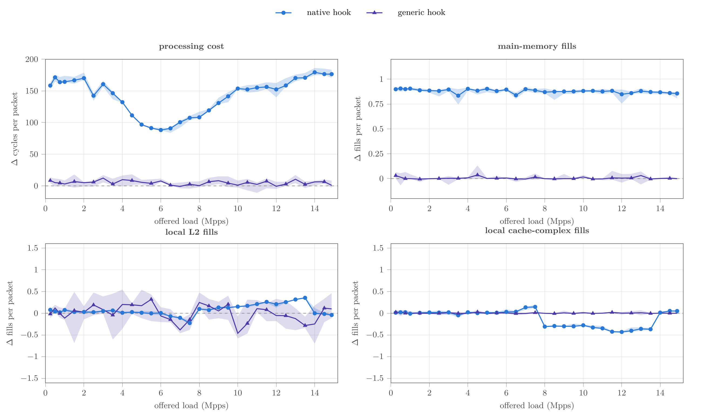

# Comparison with the Second Run Using 4096 RX Descriptors

## Summary

This document compares the reference run using 512 RX descriptors with a second run in which the RX ring was enlarged to 4096 descriptors. Both runs show the same main qualitative effect:

1. `native/no-touch` achieves nearly line rate.
2. Even the minimal read of the Ethernet header (`native/read-data`) introduces clear additional overhead.
3. At the native XDP hook, this overhead is primarily accompanied by additional fills from the source that the PMU classifies as local DRAM/IO.
4. At the generic XDP hook, the incremental effect of `read-data` is small. The substantially more expensive `skb` receive path already dominates there.
5. An RX ring with 4096 rather than 512 descriptors amplifies the native `read-data` effect: the additional fills become more uniform, and the processed rate falls to approximately 7.9 Mpps.

On this test system, the reference run with 512 descriptors therefore demonstrates a native packet-touch effect whose magnitude depends on load and measurement block. In the second run with 4096 descriptors, the effect is more stable but substantially larger.

## Experimental Setup and How to Read the Plots

Four configurations are compared:

| Hook | Variant | Meaning |
|---|---|---|
| native | `no-touch` | `XDP_DROP` without reading packet data |
| native | `read-data` | Bounds check and read of the EtherType field, followed by `XDP_DROP` |
| generic | `no-touch` | The same operation at the generic `skb` hook |
| generic | `read-data` | Minimal read at the generic `skb` hook |

Each load point consists of ten blocks. Within each block, all four configurations were measured in randomized order. An instrumented run contains a 30-second measurement window after a 5-second warm-up phase.

In the throughput plots, each point is the median of the ten processed packet rates; the band shows the minimum-to-maximum range. In the cost plots, the difference is first calculated within the same block:

```text
Delta = read-data - no-touch
```

The plotted point is then the median of the ten paired differences, while the band again shows their observed minimum and maximum. This avoids comparing variants measured far apart in time.

Important interpretation notes:

- `processed load` is the packet rate actually removed from the RX ring by the driver, not merely the configured generator rate.
- `cycles per packet` and `fills per packet` are normalized by **processed** packets. Packets discarded before reaching the ring are not included in this denominator.
- According to the hardware definition for this processor, the PMU label `lcl_dram` covers **local DRAM or I/O**. The microbenchmarks validate the mapping using ordinary DRAM accesses; in the NIC path, the value should therefore be interpreted cautiously as “DRAM/IO fills.”
- The dashed diagonal in the throughput plot represents `processed = offered`. Points below it indicate packet loss before the XDP program.

## Reference Run: 512 RX Descriptors



Up to and including 9.5 Mpps, both native variants largely follow the offered load. Above that point, `native/no-touch` remains stable almost to line rate, while `native/read-data` enters a highly variable, processing-limited regime.

At the highest load point of 14.881 Mpps, the following medians and observed ranges were measured:

| Configuration | Processed rate |
|---|---:|
| native, `no-touch` | 14.275 Mpps [14.261; 14.376] |
| native, `read-data` | 11.504 Mpps [8.040; 12.279] |
| generic, `no-touch` | 1.246 Mpps [1.244; 1.249] |
| generic, `read-data` | 1.244 Mpps [1.239; 1.247] |

The broad orange band is important: 11.504 Mpps is not a sharply defined capacity limit, but merely the median of a range containing several operating states.



At the native hook, `read-data` is more expensive than `no-touch` in all 320 paired comparisons. Across all load points, the median difference is approximately 67.9 cycles per packet. At the same time, it produces a median of 0.529 additional DRAM/IO fills per packet; the sign is also positive in all 320 pairs.

However, the magnitude of the effect depends strongly on the load and measurement block:

| Load | Delta cycles/packet | Delta DRAM/IO fills/packet |
|---:|---:|---:|
| 0.25 Mpps | 101.1 [77.9; 143.8] | 0.627 [0.499; 0.905] |
| 7.00 Mpps | 68.4 [25.6; 87.0] | 0.804 [0.213; 0.993] |
| 14.881 Mpps | 53.9 [36.6; 173.0] | 0.260 [0.168; 0.970] |

The cycle and DRAM/IO differences move together within the same blocks. Across all native pairs, the Pearson correlation coefficient is `r = 0.877`; after centering within each load point, it is even `r = 0.965`. This argues against simple timer drift and supports a real memory state that changes between measurement blocks.

By contrast, the L2 and local cache-complex differences mostly fluctuate around zero. In the reference run, the stable positive difference is concentrated primarily in the DRAM/IO category.

## Second Run: 4096 RX Descriptors



With 4096 RX descriptors, the main change is in `native/read-data`:

- The variant reaches a very stable plateau of approximately 7.9 Mpps from around 8 Mpps onward.
- `native/no-touch` remains close to line rate at approximately 14.0 Mpps.
- The generic variants remain practically unchanged relative to one another, although at approximately 1.21 Mpps they are slightly below the reference run.

At the highest load point:

| Configuration | Processed rate |
|---|---:|
| native, `no-touch` | 13.972 Mpps [13.885; 14.048] |
| native, `read-data` | 7.889 Mpps [7.667; 8.046] |
| generic, `no-touch` | 1.212 Mpps [1.205; 1.214] |
| generic, `read-data` | 1.209 Mpps [1.204; 1.216] |

Compared with the reference run, the median for `native/read-data` at the highest load point is approximately 31% lower in the second run. For `native/no-touch`, by contrast, the decrease is only around 2%. The ring effect is therefore closely associated with actually reading the packet data.



The clearest result is the nearly horizontal DRAM/IO curve: at the native hook, `read-data` causes approximately 0.83–0.91 additional fills per processed packet across practically the entire load range. The access must therefore fetch a data line from this source class for nearly every packet.

The cycle overhead is also larger and more reproducible than with the 512-descriptor ring. It is not constant, however: it initially declines across the middle load range and then rises again to approximately 170–180 cycles per packet in the processing-limited regime. At 14.881 Mpps, the medians are:

| Metric | Native difference `read-data - no-touch` |
|---|---:|
| Cycles/packet | 176.5 [167.5; 187.6] |
| DRAM/IO fills/packet | 0.856 [0.752; 0.880] |
| L2 fills/packet | -0.041 [-0.110; 0.108] |
| Local cache-complex fills/packet | 0.051 [0.014; 0.088] |

At the transition into saturation around 8 Mpps, the L2 and cache-complex categories also shift relative to one another. This is not an additional total miss with the same clarity as the DRAM/IO curve, but a change in the source of L1 fills that are already being counted. These curves should therefore not be interpreted in isolation as separate causes of cost.

The correlation between DRAM/IO fills and cycles is weak across all load points, at `r = 0.153`, but remains moderate within a load point (`r = 0.565`). The reason is plausible: once almost every packet causes exactly one such fill, the **number** of fills barely varies. The cost then additionally depends on the overlap of multiple memory accesses, batch size, ring state, and saturation.

## Direct Comparison at Jointly Saturated Native Points

For a capacity comparison, the most informative load points are those at which **both** native variants are already processing-limited. The following table pools only these jointly saturated high-load points and reports the median of the paired block differences:

| Run | Joint native saturation points | Delta cycles/packet | Delta DRAM/IO fills/packet |
|---|---|---:|---:|
| Reference run: 512 descriptors | 14.5 and 14.881 Mpps | 70.1 | 0.364 |
| Second run: 4096 descriptors | 14.0, 14.5, and 14.881 Mpps | 176.8 | 0.863 |

This comparison is cleaner than mixing unsaturated and saturated load points. It shows substantially greater cycle and DRAM/IO overhead with a 4096-descriptor ring:

```text
Ring 4096: high and stable fill overhead
    > Ring 512: lower but highly variable fill overhead
    >> generic: practically no incremental DRAM/IO overhead
```

## Why Can a Larger RX Ring Produce This Effect?

The enlarged RX ring is the central configuration change between the two runs, but the measurements do not isolate every internal driver mechanism. The following explanation is consistent with the data:

1. A ring with 4096 entries enlarges the rotation of RX descriptors, packet buffers, and associated metadata by a factor of eight relative to 512 entries.
2. `no-touch` does not require the XDP program to load the contents of the DMA-written packet data. This variant therefore reacts only slightly to the larger rotation.
3. `read-data`, by contrast, forces access to the first packet cache line. With a longer reuse distance, this line is less likely to remain available in a local cache.
4. In the second run with 4096 descriptors, nearly one additional DRAM/IO fill per packet therefore appears. Greater memory latency and less favorable reuse reduce the sustainable packet rate.

The number of descriptors must not be equated directly with a single “buffer size in bytes.” In addition to the 16-byte hardware descriptors, the ixgbe driver maintains software metadata and separately allocated packet buffers or pages. The descriptor ring itself grows from 8 KiB to 64 KiB, but the effective RX working set is larger and depends on the driver's specific buffer and recycling layout.

Furthermore, `0.86 fills/packet` cannot simply be multiplied by isolated DRAM latency. Multiple misses can overlap in time, and the processor can perform other work while an access is pending. Fill count and cycle overhead are therefore related but not identical.

## Is the Variation a Measurement or Timer Error?

The data argue against simple timer drift:

- `cycles` and the fill events are hardware PMU counters divided by processed packets; they are not calculated from an estimated CPU frequency.
- Every instrumented run checks `cycles` against the independent APERF counter. A ratio outside 0.98–1.02 invalidates the run.
- The packet-conservation check passes for the cells used here; both runs report zero invalid and zero failed cells.
- `native/no-touch` and the generic variants remain stable in both runs. A general time-base error would have to shift these curves as well.
- In the 512-descriptor case, the cycle variation covaries very strongly with an independent PMU event, the DRAM/IO fills.

This does not rule out every disturbance. In particular, the high-load `native/read-data` range in the reference run is sensitive to measurement instrumentation. Comparison with additional control runs without performance counters produced the following results for `native/read-data`:

| Run | 14.0 Mpps | 14.881 Mpps |
|---|---:|---:|
| Reference run: 512 descriptors | -6.44% | +8.86% |
| Second run: 4096 descriptors | +1.98% | +2.94% |

The sign denotes `instrumented - uninstrumented`. The PMU counters therefore do not explain the existence of the effect, but they can noticeably affect the exact high-load throughput in the unstable 512-descriptor state. The cycle and fill values necessarily come from the instrumented measurements; the uninstrumented control runs serve only to estimate this perturbation.

## What Conclusions Does the Comparison Support?

The following conclusions are supported by the data:

- A minimal read of packet data is not free in the native XDP receive path.
- At the generic hook, the effect is nearly invisible as an incremental difference because the expensive baseline path dominates there.
- The magnitude of the effect depends strongly on the RX ring and load regime.
- The larger ring is associated with nearly one additional DRAM/IO fill per processed packet and substantially lower `read-data` capacity.
- The reference run exhibits broad block ranges. Its median is therefore not a universal fixed value for cycles per packet, fills per packet, or maximum Mpps.

It would not be justified, by contrast, to claim that a single value—such as 0.804 fills per packet at 7 Mpps or 0.260 at line rate—is a general property of the XDP program. These values describe specific load points and a specific ring/system state. Capacity claims should use jointly saturated points; for investigating the mechanism, the paired differences across all loads remain informative as long as each load regime is interpreted separately.

## Data Sources

- [Reference run with 512 RX descriptors](data/paired/paired_4config_ring512_20260823/analysis.txt) with its [raw summary](data/paired/paired_4config_ring512_20260823/summary.tsv)
- [Second run with 4096 RX descriptors](data/paired/paired_4config_ring4096_20260824/analysis.txt) with its [raw summary](data/paired/paired_4config_ring4096_20260824/summary.tsv)
- [Script used to generate the plot aggregates](scripts/make_results_figure.py)
- [Validation and mapping of the AMD PMU fill events](data/artifacts/pmc043_mask_mapping_20260823.md)
